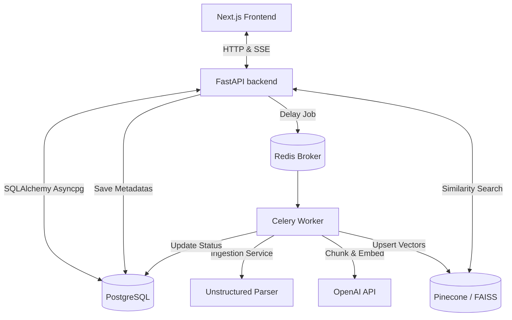

# Current Progress

This document tracks the current state of the Enterprise Multimodal RAG Application. It details the completed components and current architecture.

---

## 🏗️ Architecture Overview

The system operates as a fully integrated microservices-oriented architecture:

1. **Frontend**: A **Next.js 16.2** app styled with **Tailwind CSS v4** featuring an interactive Chat UI, a live document upload and ingestion status dashboard, dynamic sidebar thread history loading, markdown rendering, and SSE streaming.
2. **Backend API**: A **FastAPI** web framework handling client requests, thread and message history loading, chat completions SSE streaming, and document upload processing.
3. **Queue & Worker**: **Celery** with **Redis** as a broker for handling parsing and indexing asynchronously, updating database statuses upon success or failure.
4. **Relational Database**: **PostgreSQL 15** acting as the primary store for persistent records (Users, Workspaces, Documents, Chat Threads, Messages).
5. **Vector Database**: Pluggable vector store layer supporting either **FAISS** (shared persistent storage volume) or **Pinecone** (cloud vector DB) for similarity search.

---

## 🛠️ Completed Components

### 1. Backend Foundation & Core Setup
- **App Initialization**: FastAPI setup in `backend/app/main.py` with CORS, health check, and structured logging (`structlog`).
- **Configuration Management**: Centralized Pydantic Settings (`backend/app/config.py`) that programmatically constructs `DATABASE_URL` from individual connection variables to avoid env interpolation issues.
- **Async Database Connection**: SQLAlchemy async engine and session factory (`backend/app/database.py`) using `asyncpg`.
- **Automatic Schema Initialization**: Database tables are automatically initialized during FastAPI startup via `conn.run_sync(Base.metadata.create_all)`.
- **Relational Domain Models**: SQLAlchemy models (`backend/app/models/domain.py`) mapping `User`, `Workspace`, `Document`, `ChatThread`, and `Message` tables.

### 2. Retrieval-Augmented Generation (RAG) Engine
- **Document Parser**: Integrated `unstructured.partition.auto` (`backend/app/rag/document_loaders/loader.py`) supporting multiple doc types (PDF, PPTX, HTML).
- **Token Chunker**: Tiktoken-based sliding window chunker (`backend/app/rag/chunkers/chunker.py`) with configurable size/overlap.
- **OpenAI Embedder**: OpenAI Client wrapper (`backend/app/rag/embeddings/openai_embedder.py`) for generating embeddings using `text-embedding-3-small`.
- **Vector Stores**: Pluggable vector store layer supporting `PineconeVectorStore` and `FAISSVectorStore` (index is saved to shared `/app/storage/faiss_index` volume, resolving container isolation).
- **Strict RAG Generator**: Streaming response generator (`backend/app/rag/generators/generator.py`) utilizing `gpt-4o` with a zero-temperature strict system prompt and source citations.
- **Similarity Retriever**: Workspace-isolated document retriever (`backend/app/rag/retrievers/retriever.py`) that filters strictly by `workspace_id`.

### 3. API & Asynchronous Processing
- **Un-mocked Document Listing API**: `/api/v1/documents/` queries the database for all records and status badges in real-time.
- **Background Worker Status Integration**: Celery tasks run inside synchronous worker threads and use `asyncio.run()` to update PostgreSQL document statuses to `processing`, `indexed` (with JSON serialized vector IDs), or `error` state.
- **Persistent Chat completion API**: `/api/v1/chat/completions` records queries inside user/assistant tables in database, intercepting completions to save full assistant transcripts once streams end, yielding the active thread ID at the start of standard SSE payloads.
- **Chat Thread Management APIs**: Added endpoints to list threads (`GET /threads`) and fetch messages (`GET /threads/{id}/messages`).

### 4. Interactive Frontend
- **Clean Layout**: Multi-column screen-locked interface featuring a dynamic sidebar layout and tab switcher.
- **Ingestion Control Room**: New interactive tab featuring drag-and-drop file upload, size/type parameters, real-time status badges, and polling checks.
- **Dynamic Conversations Sidebar**: Displays real-time lists of saved chat threads, active highlighting, and a **"Start New Chat" (+)** button to reset session state.
- **SSE Stream Engine**: Client-side reader utilizing Fetch `ReadableStream` API to decode streaming JSON packets on-the-fly, citations rendering, and active thread loader with a skip check to prevent mid-stream reloads.
