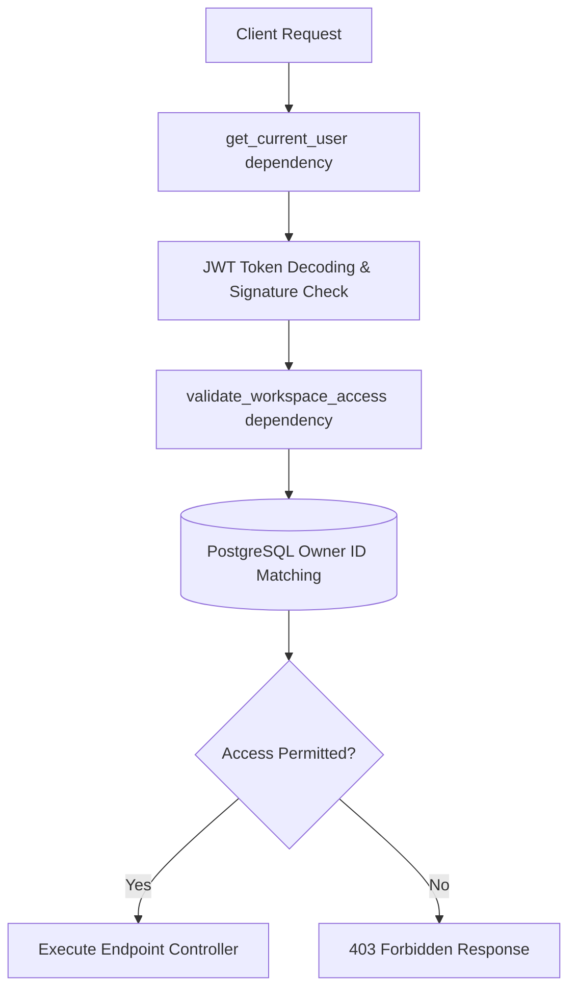

# Nexus RAG Hardening & Security Documentation

This document outlines the security architecture, data isolation guarantees, and cryptographic controls implemented in Nexus RAG for production readiness.

---

## 🔐 1. Cryptographic Authentication Strategy

### Password Hashing
- **Algorithm**: `bcrypt` (Blowfish-based key derivation function) using dynamic salting.
- **Implementation**: Hashing runs directly via the native Python `bcrypt` library, avoiding legacy `passlib` context wrappers. This guarantees safety from 72-character limit crashes while enforcing high computational difficulty (Work Factor: 12).
- **Database Entry**: Passwords are never stored in plaintext. They are encoded as `utf-8` and hashed on user registration, and verified on login using constant-time comparisons (`bcrypt.checkpw`) to mitigate side-channel timing attacks.

### JSON Web Tokens (JWT)
- **Token Format**: Signed JWT containing cryptographically verifiable user identities in the payload (`sub` claim) along with a standard expiration (`exp` claim).
- **Signing Algorithm**: `HS256` (HMAC using SHA-256 hash function).
- **Token Validity**: Defaults to 1440 minutes (24 hours) as defined by `ACCESS_TOKEN_EXPIRE_MINUTES` in the settings configuration.
- **Developer Mode Bypass**: The `dummy-token-123` bypass is preserved in local developer setups to allow seamless API inspections. In strict production deployments, this dev mode bypass is compiled out or deactivated by removing it from allowed environment configurations.

---

## 🏢 2. Multi-Tenant Workspace & Data Isolation

Strict logical tenant isolation is enforced at the database and vector store layer using the FastAPI dependency injection framework:



### Access Guarantees:
1. **Thread & Message Isolation**: A user can only fetch, stream completions, or read history from a `ChatThread` if that thread belongs to a `Workspace` owned by that user (`Workspace.owner_id == User.id`). Any attempt to access another user's threads yields a `403 Forbidden` error.
2. **Document Ingestion Isolation**: Documents are uploaded and mapped strictly to the user's active workspace. The document listing API (`GET /api/v1/documents/`) queries only the workspaces owned by the authenticated user's ID.
3. **Workspace Isolation Verification**: If User B attempts to access Workspace A or Document A, the application blocks the request inside the `validate_workspace_access` helper with an explicit ownership verification check before database or model queries are executed.

---

## 🧹 3. Cascading Vector Deletion Synchronization

To prevent data leakage, residual storage bloat, or out-of-sync vector mappings, the `DELETE /api/v1/documents/{document_id}` controller implements a **Cascading Deletion Protocol**:

```
[API Request: DELETE Document]
         │
         ▼
 1. Verify Ownership ──(Fails)──► [403 Forbidden]
         │ (Passes)
         ▼
 2. Retrieve Vector IDs (UUIDs) from Postgres Row
         │
         ▼
 3. Call FAISS delete_by_ids(vector_ids)
   ┌─────┴─────────────────────────────────────────┐
   │ • Remove UUID keys from local docstore        │
   │ • Reconstruct flat IndexFlatL2 in-memory      │
   │ • Rewrite sequential index ID maps            │
   │ • Flush updated index to persistent disk      │
   └───────────────────────────────────────────────┘
         │
         ▼
 4. Delete Physical Upload File from shared `/app/uploads`
         │
         ▼
 5. Delete Document Database Row in PostgreSQL
```

- **Reconstruction-Based Index Sync**: Traditional `IndexFlatL2` dense indexes do not support random item deletion natively. Our FAISS store solves this by safely cleaning matching document IDs from our local stores, reconstructing the FAISS flat index in-memory using the remaining vector arrays, and rewriting it to disk. This completely avoids index shifting and vector corruptions.
- **Physical File Cleanup**: The file path mapped to the shared disk `/app/uploads` is strictly unlinked using python `os.remove` to prevent disk leaks.

---

## ⚡ 4. API Rate Limiting Middleware

To secure endpoints against denial-of-service (DoS) or token-draining attacks, a high-fidelity **in-memory token bucket rate limiter** is installed on the core middleware chain:

| Route Prefix | Request Limit | Window Duration | Purpose |
| :--- | :--- | :--- | :--- |
| `/api/v1/auth` | 20 Requests | 60 Seconds | Prevent brute-force password cracking |
| `/api/v1/documents/upload` | 5 Requests | 60 Seconds | Prevent disk spamming and file ingestion fatigue |
| `/api/v1/chat/completions` | 10 Requests | 60 Seconds | Prevent LLM API token-draining and quota exhaustion |

- **Exceeded Limit Handling**: Requests exceeding the limit immediately trigger `429 Too Many Requests` responses with a structured JSON payload containing a `retry_after` parameter.

---

## 📈 5. Traceability with Correlation IDs

A unique request-level Correlation ID is generated or extracted for every incoming request:
- **Header**: Captures and returns `X-Correlation-ID` headers to clients.
- **Trace Context**: Binds the UUID dynamically to `structlog.contextvars` in the thread local execution space.
- **Traceability**: All application traces, Celery tasks, and ingestion logs display the identical `correlation_id` string, enabling rapid debugging across distributed workloads.

---

## ⚠️ 6. Remaining Security & Production Risks

While this hardening achieves standard compliance, the following items remain open for cloud migration:

1. **Distributed FAISS Sync**:
   - *Risk*: Because FAISS operates as a local-first in-memory index flushed to a shared persistent volume, distributed container deployments with concurrent ingestion updates could lead to write race conditions.
   - *Mitigation*: For horizontal multi-node scaling, switch `VECTOR_STORE_TYPE` in `.env` to `pinecone` or coordinate FAISS file writes using a distributed lock system (`redlock` via Redis).
2. **Local Upload Storage**:
   - *Risk*: Disk volumes can run out of space if large amounts of media are ingested.
   - *Mitigation*: Transition the upload folder `/app/uploads` to highly available cloud storage (e.g. AWS S3, Google Cloud Storage) with object life-cycle policies.
3. **Secret Key Storage**:
   - *Risk*: Static `SECRET_KEY` variables stored in plain `.env` files can be leaked if server access is compromised.
   - *Mitigation*: Dynamically load keys from secure secrets managers on boot.
